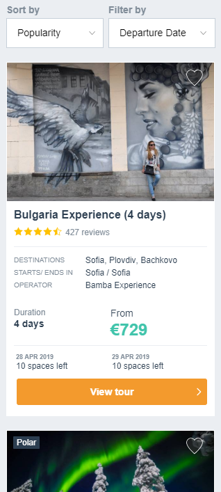
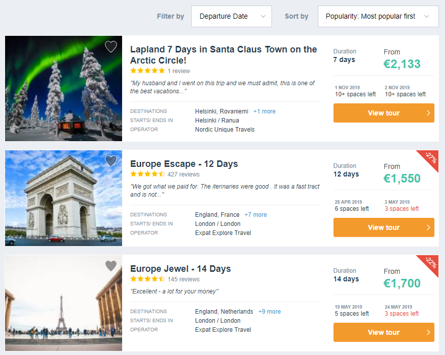

# TourRadar 

## Frontend Engineer Test Case
### Context
To support the travelling needs of our users we have around 35,000 tours live on our website exposed through various page types, such as a Tour Detail Page (TDP) or Search Engine Results Pages (SERPs). For this test case you will focus on a sample SERP page that lists our tours for Europe, which is our highest traffic page. Therefore the page is highly optimised to bring the best experience to our users. This is made possible by taking various aspects into consideration during development process on day to day basis.

### Questions we ask you to answer:
- How would you ensure that the page is fully responsive and developed with mobile-first in mind?
- What sort of optimizations would you suggest for better UI/UX? Are there any tools/metrics that can help to achieve and/or measure these goals?
- How would you make sure that the page works as expected on all supported browsers/devices?
- What criteria would you consider for choosing the tech stack for this test case?

### Things we ask you to implement
Alongside a responsive website that looks like the screenshots below, your proposed solution should at least implement the following features:
  - Fetch provided data from https://mocki.io/v1/11356aa2-6371-41d4-9d49-77a5e9e9924f
  - Sort by lowest and highest price
  - Sort by longest and shortest tour
  - Filter by depature month using departure date dropdown

##### Screenshots
From the smallest supported screen

up to bigger desktop screen dimension

##### Things you should consider  
- You must not use any big JS frameworks/library (React, Vue, AngularJS, Bootstrap and etc.); using a small library/module (ZeptoJS, jQuery, Moment.js and etc.) for a specific task is perfectly fine. 
- You must not use any CSS library (like Bootstrap); using a CSS Preprocessors like SCSS or LESS is perfectly fine. 
- Your attempted solution should support IE 11+, Edge 12+, FF 28+, Chrome 29+, Safari 9.0+ versions.

## When is this test case due?
You should submit the solution to this testcase within 72 hours.

## How to ask questions?
Is there something ambiguous in the test case? Some of the ambiguity has been intentionally left in there to give room to your creativity.

If there is a question that appears to be a blocker, please head over to issues and create a New Issue. Make sure to assign the newly created issue to one of the available options (except tourradar-testcases). Being explicit in your question will help us provide better and more contextual answers. 

## How to submit?
- Create a new branch in this repository.
- Add your solution in a subdirectory; say *solution* in that branch.
- Push the branch to this repository.
- Create a new Pull Request for your branch against `master`. Please keep the pull request open for reviews (more details below).

## How does the review process happen?
- One or more TourRadar Senior Engineers will go through your solution and leave their feedback.
In most cases this happens within 2 business days of the submission. If you do not hear anything back from 
reviewers in 3 business days please reach out to your contact in our recruiter team.
- Based on our evaluation of your solution, a decision will be made about whether to advance you in the progress.
- Once the solution has been reviewed and evaluated, our Recruiting team will get back to you with next steps.
